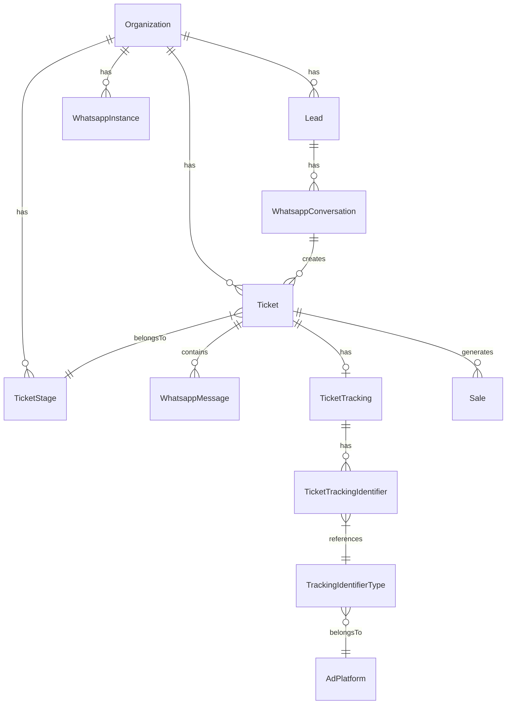

# WhaTrack - Sistema de Tickets: PRD

## Visão Geral

O sistema de Tickets do WhaTrack conecta **Leads** (contatos) a **Conversas do WhatsApp** e oferece um fluxo de atendimento com **Estágios (Kanban)**, **Atribuição de Tarefas**, e **Rastreamento de Origem (UTM/Click IDs)**.

---

## Modelo de Dados



### Entidades Principais

| Modelo | Descrição |
|--------|-----------|
| `Ticket` | Unidade de atendimento. Vinculado a uma conversa e uma organização. |
| `TicketStage` | Etapa do Kanban (ex: "Novo", "Em Andamento", "Fechado"). |
| `TicketTracking` | Dados de rastreamento de origem (UTM e plataforma de anúncios). |
| `TicketTrackingIdentifier` | Click IDs dinâmicos (gclid, fbclid, ctwaclid). |
| `WhatsappMessage` | Mensagens da conversa, vinculadas ao ticket. |
| `Sale` | Venda realizada a partir de um ticket. |

---

## Enums

| Enum | Valores | Uso |
|------|---------|-----|
| `TicketSourceType` | `paid`, `organic` | Classifica a origem do ticket. |
| `TicketCreatorType` | `USER`, `SYSTEM` | Quem criou o ticket. |

---

## Fluxo de Criação de Ticket (`POST /api/v1/tickets`)

1.  **Find or Create Lead**: Busca lead por `phone` ou `email`. Cria se não existir.
2.  **Resolve Instance**: Usa a instância fornecida ou a primeira da organização.
3.  **Find or Create Conversation**: Busca conversa existente (lead + instance) ou cria nova.
4.  **Create Ticket**: Cria o ticket com:
    *   Vínculo com `WhatsappConversation`
    *   `stageId` (primeiro estágio por padrão)
    *   `assigneeId` e `assigneeName`
    *   `dealValue` (valor em negociação)
5.  **Create Tracking & Identifiers**: Cria `TicketTracking` com UTMs e, se houver click IDs, cria os `TicketTrackingIdentifier`.

### Request Body

```json
{
  "lead": {
    "name": "João Silva",
    "phone": "+5511999998888",
    "email": "joao@email.com"
  },
  "ticket": {
    "utmSource": "google",
    "utmMedium": "cpc",
    "utmCampaign": "lead_gen",
    "gclid": "EAIaIQobChMI...",
    "sourceType": "paid",
    "stageId": "clxyz123",
    "dealValue": 1500.00
  }
}
```

---

## Listagem de Tickets (`GET /api/v1/tickets`)

### Query Params

| Param | Tipo | Descrição |
|-------|------|-----------|
| `q` | `string` | Busca por nome/telefone do lead, ID ou assignee. |
| `page` | `number` | Paginação (default: 1). |
| `pageSize` | `number` | Itens por página (default: 20, max: 100). |
| `dateRange` | `preset` | `today`, `7d`, `30d`, `thisMonth`, `lastMonth`, etc. |
| `stageId` | `string` | Filtrar por estágio. |
| `origin` | `string` | Filtrar por `utmSource`. |
| `source` | `string` | Filtrar por `sourceType` (paid/organic). |
| `hasSales` | `boolean` | Filtrar apenas tickets com vendas. |

### Response

```json
{
  "items": [
    {
      "id": "clxyz789",
      "leadName": "João Silva",
      "leadPhone": "+5511999998888",
      "utmSource": "google",
      "sourceType": "paid",
      "stage": { "id": "...", "name": "Novo", "color": "#3b82f6" },
      "dealValue": 1500.00,
      "messagesCount": 12,
      "salesCount": 1,
      "totalValue": 1200.00,
      "createdAt": "2026-01-15T10:30:00Z"
    }
  ],
  "total": 150,
  "page": 1,
  "pageSize": 20,
  "origins": ["google", "facebook", "organic"],
  "sources": ["paid", "organic"],
  "stages": [...]
}
```

---

## API de Inbounds (`GET /api/v1/tickets/inbounds`)

Endpoint especializado para visualização de **tracking data**, focado em Click IDs e UTMs. Similar ao GET principal, mas retorna estrutura otimizada para análise de marketing.

### Response Item

```json
{
  "id": "clxyz789",
  "status": "open",
  "gclid": "EAIaIQobChMI...",
  "fbclid": null,
  "ctwaclid": null,
  "utmSource": "google",
  "utmMedium": "cpc",
  "utmCampaign": "lead_gen",
  "leadId": "...",
  "leadName": "João Silva",
  "createdAt": "2026-01-15T10:30:00Z"
}
```

---

## Atualização de Ticket (`PATCH /api/v1/tickets/[id]`)

### Request Body

```json
{
  "stageId": "clxyz_fechado",
  "assigneeId": "user_123",
  "dealValue": 2000.00
}
```

---

## Sistema de Estágios (`TicketStage`)

Estágios são criados automaticamente por organização se não existirem (`ensureTicketStages`).

| Campo | Tipo | Descrição |
|-------|------|-----------|
| `name` | `string` | Nome do estágio (ex: "Novo Lead"). |
| `color` | `string` | Cor hexadecimal para UI. |
| `order` | `number` | Ordem no Kanban. |

---

## Tracking e Atribuição

### UTM Parameters

Armazenados diretamente em `TicketTracking`:
*   `utmSource`, `utmMedium`, `utmCampaign`, `utmTerm`, `utmContent`

### Click IDs (Dinâmico)

Armazenados em `TicketTrackingIdentifier`, referenciando `TrackingIdentifierType`:
*   `gclid` (Google Click ID)
*   `fbclid` (Facebook Click ID)
*   `ctwaclid` (Click to WhatsApp Ads)

### Plataformas de Anúncios (`AdPlatform`)

Pré-configuradas:
*   Google Ads
*   Meta Ads
*   TikTok Ads

---

## UI: Dashboard de Tickets

A página `/dashboard/tickets` oferece:

1.  **Tabela Paginada** com filtros (estágio, origem, período).
2.  **Indicadores Rápidos**: Total de tickets, com vendas, valor em negociação.
3.  **Ações Rápidas**: Mover para estágio, atribuir, editar deal value.

---

## Observações Finais

Este sistema foi projetado para integrar **CRM leve** com **atendimento via WhatsApp** e **atribuição de marketing**. A estrutura de tracking permite análises de ROI por campanha e plataforma.
