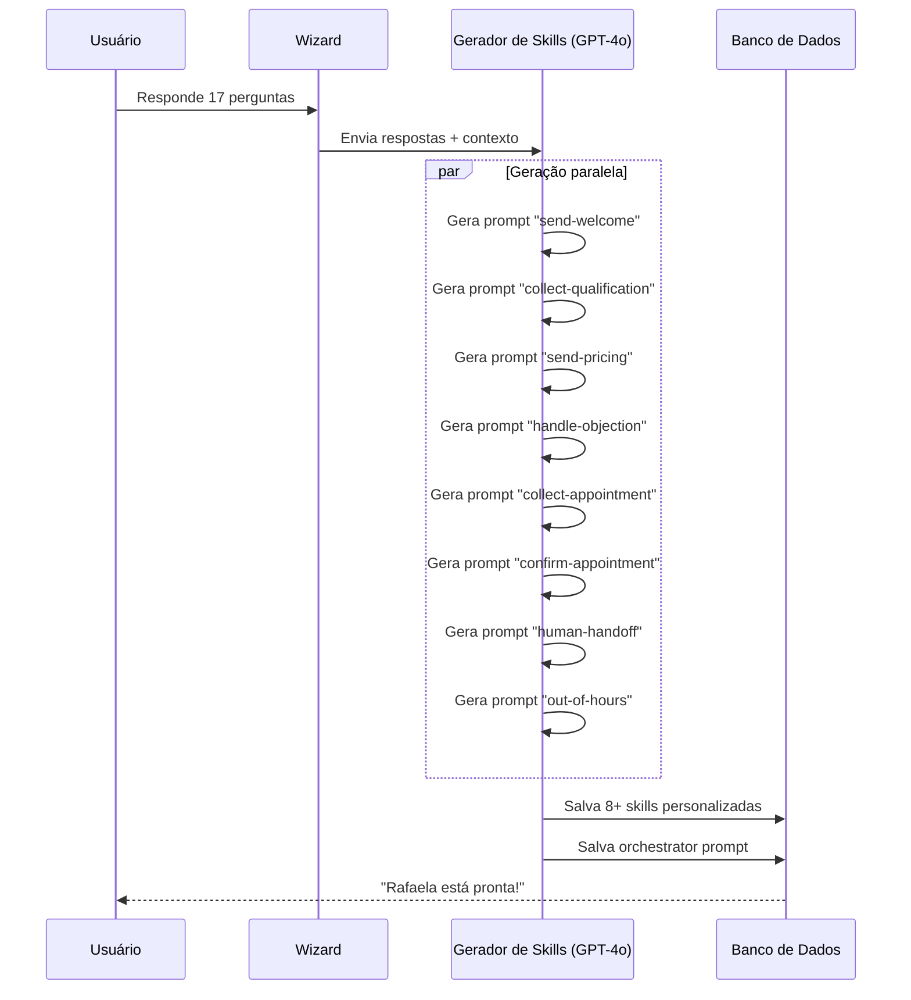
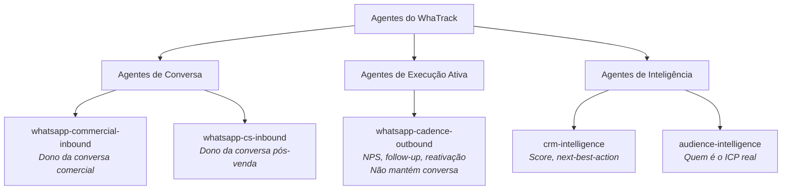
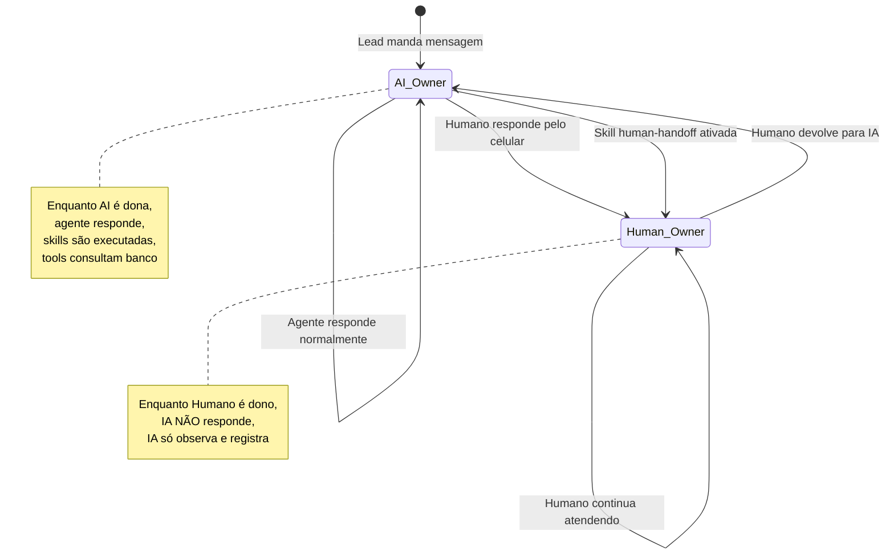
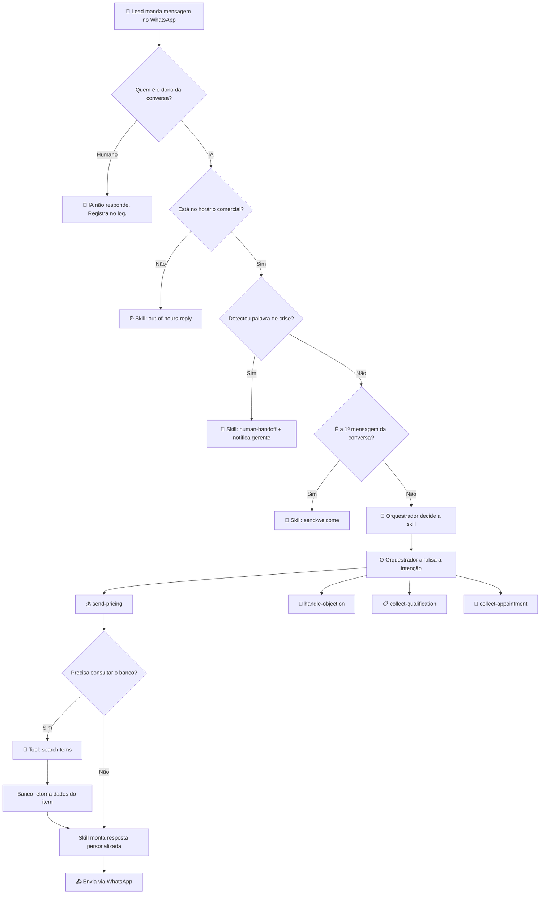

# PRD — WhaTrack AI System v2
## "O Dublê Digital da Empresa"

> **Versão**: 2.0
> **Data**: 2026-03-24
> **Autor**: Thiago Gontijo + Antigravity AI
> **Status**: Draft para validação

---

## 1. Visão Geral

### O que é?
O WhaTrack AI System é um **sistema de atendimento inteligente via WhatsApp** que funciona como um "Dublê Digital" do dono da empresa. Ele atende leads, qualifica, responde dúvidas, apresenta preços e agenda — tudo seguindo o tom, as regras e a personalidade que o dono definiu.

### O que NÃO é?
- Não é um chatbot genérico com respostas prontas.
- Não é um sistema que exige conhecimento técnico do usuário.
- Não é uma ferramenta que precisa de manutenção constante.

### Princípio Central
> **O usuário configura a "personalidade". A IA faz o resto.**
>
> O dono da empresa responde perguntas simples sobre como ele gosta de atender.
> O sistema transforma essas respostas em um time de especialistas invisíveis.
> Cada especialista cuida de uma parte da conversa (boas-vindas, preço, objeção, agendamento).
> Quando o especialista não sabe algo, ele consulta o banco de dados ao vivo.

---

## 2. Jornada do Usuário (O que ele vê e faz)

### Fase 1: Onboarding — "A Entrevista" (5–8 minutos)

O usuário acabou de criar o projeto no WhaTrack e conectou o WhatsApp.
Ao entrar no **AI Studio**, ele vê:

```
┌─────────────────────────────────────────────────────┐
│                                                     │
│   🤖  Vamos criar o seu Dublê Digital?              │
│                                                     │
│   Responda algumas perguntas rápidas para eu        │
│   aprender como sua empresa fala no WhatsApp.       │
│                                                     │
│   ⏱️ Leva cerca de 5 minutos                        │
│                                                     │
│          [ Começar agora → ]                        │
│                                                     │
└─────────────────────────────────────────────────────┘
```

#### Perguntas do Wizard (Agrupadas em 5 Fases)

**Fase A — Identidade do Atendente (3 perguntas)**

| # | Pergunta | Tipo | Exemplo |
|---|----------|------|---------|
| 1 | Qual o gênero do seu atendente? | Escolha única | Feminino / Masculino |
| 2 | Qual o nome do atendente? | Texto livre | "Rafaela", "Lucas" |
| 3 | O nome da sua marca deve aparecer na conversa? | Escolha única | Sempre / Quando relevante / Não |

**Fase B — Personalidade (4 perguntas)**

| # | Pergunta | Tipo | Exemplo |
|---|----------|------|---------|
| 4 | Qual o estilo de comunicação? | Escolha única com exemplo | Acolhedor / Profissional / Direto / Conversacional |
| 5 | Nível de formalidade? | Escolha única | Formal / Semi-formal / Informal |
| 6 | Usar emojis? | Escolha única | Não / Com moderação / Com frequência |
| 7 | Nível de empatia nas respostas? | Escolha única com exemplo | Alto / Médio / Baixo |

**Fase C — Estratégia Comercial (4 perguntas)**

| # | Pergunta | Tipo | Exemplo |
|---|----------|------|---------|
| 8 | Postura de vendas? | Escolha única com exemplo | Consultivo / Equilibrado / Assertivo (Closer) |
| 9 | Tom da primeira mensagem? | Escolha única com exemplo | Completo / Direto / Acolhedor |
| 10 | Se o cliente perguntar o preço antes da hora? | Escolha única | Segurar e contextualizar / Dar o valor e redirecionar |
| 11 | Qual o principal diferencial do seu negócio? | Texto livre | "Atendimento personalizado", "Entrega em 24h" |

**Fase D — Regras e Limites (4 perguntas)**

| # | Pergunta | Tipo | Exemplo |
|---|----------|------|---------|
| 12 | O atendente pode dar descontos? | Escolha única | Nunca / Encaminhar para avaliação |
| 13 | Técnica de fechamento? | Escolha única com exemplo | Assumir agendamento ("Qual horário?") / Sugerir opções |
| 14 | O atendente deve se identificar como IA? | Escolha única | Sim, ser transparente / Não, apenas "assistente" |
| 15 | O que o atendente NÃO pode fazer? | Texto livre | "Nunca prometer prazo de entrega", "Nunca falar da concorrência" |

**Fase E — Escalação Humana (2 perguntas)**

| # | Pergunta | Tipo | Exemplo |
|---|----------|------|---------|
| 16 | Quando chamar um humano? | Múltipla escolha | Quando pedir / Reclamação / Dúvida técnica / Travou o processo |
| 17 | Quem deve ser notificado? | Texto livre | "WhatsApp do gerente: 31999..." |

**Total: 17 perguntas simples. ~5 minutos.**

> [!IMPORTANT]
> O Wizard NÃO pede lista de produtos, preços ou FAQ.
> Essas informações serão consultadas **ao vivo** no banco de dados via Tools.

---

### Fase 2: Geração do Agente — "O Treinamento" (~30 segundos)

Após finalizar o Wizard, o usuário vê uma tela premium:

```
┌─────────────────────────────────────────────────────┐
│                                                     │
│   ✨ Treinando a Rafaela...                         │
│                                                     │
│   ████████████░░░░░░░░░░  60%                       │
│                                                     │
│   ✓ Especialista em Boas-vindas          pronto     │
│   ✓ Especialista em Qualificação         pronto     │
│   ◌ Especialista em Preço               gerando...  │
│   ◌ Especialista em Objeções            aguardando  │
│   ◌ Especialista em Agendamento         aguardando  │
│   ◌ Protocolo de Emergência             aguardando  │
│                                                     │
└─────────────────────────────────────────────────────┘
```

#### O que acontece por trás:



---

### Fase 3: Painel de Controle — "O Dia a Dia"

O usuário agora tem seu agente rodando. Ele vê 4 áreas:

#### 3a. Card do Agente (Visão Rápida)

```
┌─────────────────────────────────────────────────────┐
│  👩 Rafaela — Atendente Comercial                   │
│                                                     │
│  Status: ● Ativo       Debounce: 8s                │
│  Estilo: Acolhedor     Emojis: Moderado            │
│                                                     │
│  Hoje: 12 atendimentos | 3 agendamentos | 1 escal. │
│                                                     │
│       [ Pausar ]   [ Refazer Wizard ]               │
└─────────────────────────────────────────────────────┘
```

#### 3b. Centro de Treinamento (Ajustes Simples)

O que o usuário pode editar SEM refazer o wizard:

| O que ele quer mudar | Onde ele muda | O que acontece |
|---|---|---|
| Preço de um produto | Catálogo de Itens (já existe) | A Tool busca o novo preço automaticamente |
| Horário de atendimento | Configurações do Projeto | O agente respeita imediatamente |
| Uma regra nova | Caixa "Instruções Adicionais" | A IA incorpora na próxima conversa |
| Tom de voz | Refazer o Wizard | Regenera as skills |

#### 3c. Linha do Tempo (Logs)

```
┌─────────────────────────────────────────────────────┐
│  📋 Últimas ações da Rafaela                        │
│                                                     │
│  09:14  João Silva perguntou preço                  │
│         → Skill: send-pricing ✓                     │
│         → Tool: searchItems("cadeira gamer") ✓      │
│         → Resposta: "O investimento é R$ 899..."    │
│                                                     │
│  09:12  Maria Souza mandou "oi"                     │
│         → Skill: send-welcome ✓                     │
│         → Resposta: "Oi Maria! Sou a Rafaela..."    │
│                                                     │
│  09:08  Carlos Lima insatisfeito com prazo           │
│         → Skill: human-handoff ✓                    │
│         → Notificou gerente via WhatsApp             │
└─────────────────────────────────────────────────────┘
```

#### 3d. Insights (Futuro — Fase 2)

```
┌─────────────────────────────────────────────────────┐
│  🧠 O que a Rafaela aprendeu este mês              │
│                                                     │
│  • 68% dos leads perguntam preço na 1ª mensagem     │
│  • Leads que passam pela qualificação convertem 3x  │
│  • Seu ICP real: Homens 25-35, interesse em Gaming  │
│  • Sugestão: Priorizar o item "Cadeira Gamer Pro"   │
│                                                     │
│       [ Ver relatório completo ]                    │
└─────────────────────────────────────────────────────┘
```

---

## 3. Arquitetura Técnica

### 3.1 Taxonomia de Agentes



### 3.2 O que cada tipo faz

| Tipo | Mantém conversa? | Wizard? | Tools? | Exemplo |
|---|---|---|---|---|
| **Conversa** | ✅ Sim, é o dono da thread | ✅ Wizard longo (17 perguntas) | ✅ searchItems, getItemDetails | Atendente Comercial |
| **Execução Ativa** | ❌ Dispara e transfere | ⚙️ Configuração de automação | ✅ Templates, Audiência | Cadência de NPS |
| **Inteligência** | ❌ Nunca fala com cliente | ❌ Sem wizard | ✅ Leitura do banco | Análise de ICP |

### 3.3 Ownership da Conversa (AI vs Humano)



### 3.4 Fluxo de uma mensagem (Do WhatsApp até a resposta)



### 3.5 Tools (Ferramentas do Agente)

As Tools são as "mãos" do agente. Ele usa para buscar informação ao vivo.

| Tool | O que faz | Quando é chamada |
|---|---|---|
| `search-items` | Busca produtos/serviços por nome ou categoria | Lead pergunta sobre produto específico |
| `get-item-details` | Retorna preço, descrição e status de um item | Lead quer saber o preço |
| `check-business-hours` | Verifica se está no horário comercial | A cada mensagem recebida |
| `get-lead-context` | Lê o histórico do lead no CRM | Para personalizar a abordagem |
| `search-faq` | Busca respostas em base de conhecimento (futuro) | Dúvidas operacionais |

### 3.6 Skills do Agente Comercial

Geradas pelo Wizard. Cada uma tem seu próprio prompt personalizado.

| Skill | Papel | Quando é ativada |
|---|---|---|
| `send-welcome` | Primeira impressão, rapport, permissão para triagem | 1ª mensagem do lead |
| `collect-qualification` | Entender a dor/necessidade do lead | Após boas-vindas |
| `explain-product-service` | Apresentar o valor do produto/serviço | Lead quer saber como funciona |
| `send-pricing` | Informar preço com segurança | Lead pede valor |
| `handle-objection` | Reverter objeções de preço, prazo, etc. | Lead resiste |
| `collect-appointment` | Fechar agendamento ou próximo passo | Lead aceitou o valor |
| `confirm-appointment` | Confirmar e reduzir no-show | Após agendamento |
| `human-handoff` | Transferir para humano com contexto | Crise, pedido, impasse |
| `out-of-hours-reply` | Gerenciar expectativa fora do horário | Mensagem fora do expediente |
| `emergency-protocol` | Mensagens fixas de segurança (deterministic) | Detecção de crise |

---

## 4. Modelo de Dados (Mudanças necessárias)

### 4.1 Campos novos em `AiProjectConfig`

```prisma
model AiProjectConfig {
  // ... campos existentes ...
  
  // Wizard v2
  wizardCompleted      Boolean   @default(false)
  wizardCompletedAt    DateTime?
  wizardAnswers        Json?     // As 17 respostas estruturadas
  
  // Identidade do Atendente
  attendantName        String?
  attendantGender      String?   // "female" | "male"
  brandMention         String?   // "always" | "relevant" | "never"
  
  // Personalidade
  communicationStyle   String?   // "warm" | "professional" | "direct" | "conversational"
  formalityLevel       String?   // "formal" | "semi" | "informal"
  emojiUsage           String?   // "none" | "moderate" | "frequent"
  empathyLevel         String?   // "high" | "medium" | "low"
  
  // Estratégia Comercial
  commercialPosture    String?   // "consultive" | "balanced" | "assertive"
  welcomeTone          String?   // "complete" | "direct" | "warm"
  earlyPriceApproach   String?   // "context" | "base"
  mainDifferential     String?
  
  // Regras
  discountPolicy       String?   // "strict" | "flex"
  closingTechnique     String?   // "assume" | "options"
  iaDisclosure         String?   // "transparent" | "soft"
  operationalLimits    String?
  
  // Escalação
  handoffTriggers      Json?     // ["request", "complaint", "technical", "impasse"]
  // escalationContact  String?   -- já existe
  
  // Ownership
  defaultOwnerType     String    @default("ai") // "ai" | "human"
}
```

### 4.2 Novo campo em `AiConversationState`

```prisma
model AiConversationState {
  // ... campos existentes ...
  
  ownerType            String    @default("ai")   // "ai" | "human"
  ownerChangedAt       DateTime?
  ownerChangedBy       String?   // "system" | "human_reply" | "handoff_skill"
}
```

---

## 5. Fases de Implementação

### Fase 1: Fundação (Semana atual)
> **Meta: Wizard rodando + Gerador de Skills + Tools básicas**

- [ ] Atualizar schema Prisma com campos do Wizard v2
- [ ] Criar componente `GenericWizard` (17 perguntas, 5 fases)
- [ ] Criar `generate-skills-from-wizard.ts` genérico (adaptar do dra_tatiana)
- [ ] Criar Tools: `search-items`, `get-item-details`
- [ ] Integrar Tools no `skill-runner.ts`
- [ ] Refatorar `chooseSkill()` para usar o Orquestrador ao invés de regex

### Fase 2: Controle (Semana seguinte)
> **Meta: Ownership AI vs Humano + Cadência Outbound**

- [ ] Implementar ownership na `AiConversationState`
- [ ] Detectar "echo" de mensagem humana e transferir ownership
- [ ] Criar tela de configuração de Cadências (NPS, Follow-up)
- [ ] Implementar `whatsapp-cadence-outbound` agent
- [ ] Criar "Botão de devolver para IA" no painel

### Fase 3: Inteligência (Futuro próximo)
> **Meta: O sistema aprende sozinho**

- [ ] Implementar `audience-intelligence` agent
- [ ] Análise periódica de conversas para descoberta de ICP real
- [ ] Dashboard de Insights ("O que a Rafaela aprendeu este mês")
- [ ] Auto-sugestão de ajustes no Wizard
- [ ] Base de conhecimento / FAQ dinâmica

---

## 6. Critérios de Sucesso

| Métrica | Meta |
|---|---|
| Tempo de onboarding (Wizard) | < 5 minutos |
| Tempo de geração do agente | < 45 segundos |
| Taxa de intervenção humana | < 20% das conversas |
| Satisfação do lead (NPS) | > 70 |
| Precisão de preço via Tool | 100% (lê do banco ao vivo) |
| Uptime do agente | 99.5% |

---

## 7. O que o usuário NUNCA precisa ver

| Conceito técnico | O que o usuário vê no lugar |
|---|---|
| Prompt de Sistema | "Personalidade da Rafaela" |
| Skill Routing | "A Rafaela decidiu responder sobre preço" |
| Blueprint | "Tipo de atendente: Comercial" |
| Tool Execution | "Rafaela consultou o catálogo" |
| AiConversationState | "Status: Rafaela está atendendo / Você está atendendo" |
| Orchestrator Prompt | (invisível) |

---

## 8. Riscos e Mitigações

| Risco | Mitigação |
|---|---|
| Geração de skills demora muito | Gerar em paralelo (Promise.all) como no dra_tatiana |
| Tool retorna item inexistente | Fallback: "Não encontrei esse item, mas posso te ajudar com..." |
| Usuário não completa o Wizard | Salvar progresso a cada passo (auto-save) |
| IA responde quando humano já assumiu | Ownership check obrigatório antes de qualquer resposta |
| Custo de tokens alto | Sparse context injection: cada skill recebe só o necessário |
